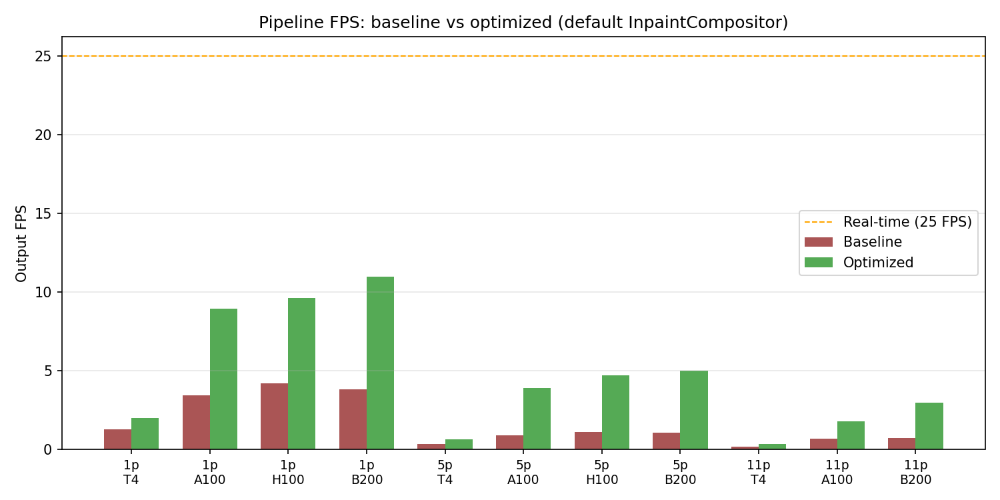
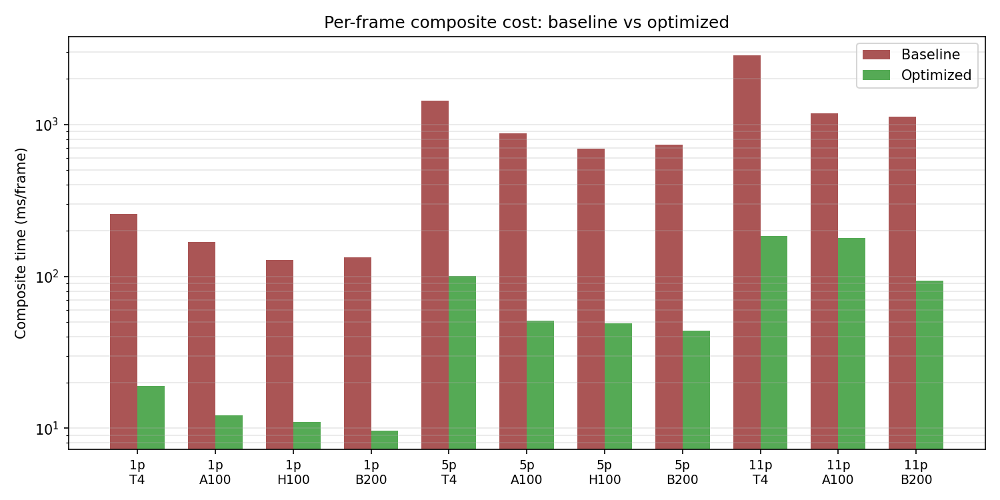

# Performance Optimization Report

Baseline matrix vs post-optimization matrix on `perf/optimize` branch.
All numbers are mean of 3 benchmark runs per (config, GPU) combination.

## Default pipeline (InpaintCompositor — visually identical output)

| Prompts | GPU | FPS before | FPS after | **Speedup** | Composite ms (before → after) | Segment s (before → after) |
|---:|---|---:|---:|---:|---:|---:|
| 1 | T4 | 1.27 | **1.98** | **1.56×** | 258 → **19** | 97.7 → 94.0 |
| 1 | A100 | 3.42 | **8.96** | **2.62×** | 169 → **12** | 18.7 → 17.3 |
| 1 | H100 | 4.21 | **9.61** | **2.28×** | 129 → **11** | 15.2 → 15.6 |
| 1 | B200 | 3.82 | **10.97** | **2.87×** | 133 → **10** | 16.9 → 14.2 |
| 5 | T4 | 0.33 | **0.64** | **1.91×** | 1438 → **100** | 286.6 → 275.0 |
| 5 | A100 | 0.90 | **3.90** | **4.32×** | 872 → **51** | 34.0 → 31.8 |
| 5 | H100 | 1.11 | **4.70** | **4.23×** | 692 → **49** | 28.9 → 23.7 |
| 5 | B200 | 1.05 | **5.01** | **4.76×** | 738 → **44** | 29.2 → 23.5 |
| 11 | T4 | 0.17 | **0.33** | **1.92×** | 2868 → **185** | 576.2 → 545.2 |
| 11 | A100 | 0.66 | **1.80** | **2.72×** | 1190 → **178** | 45.8 → 53.7 |
| 11 | H100 | (baseline was substituted to H200) | **2.72** | — | — → **97** | — → 38.4 |
| 11 | B200 | 0.72 | **2.97** | **4.10×** | 1125 → **94** | 36.2 → 36.1 |

> Note: the baseline run for `11 prompts × H100` was actually allocated an
> H200 by Modal at the time of the original benchmark (capacity-driven
> substitution). The post-perf run got an actual H100, so we report the
> absolute number without a direct comparison ratio.

## Fast mode (AlphaCompositor — opt-in, no inpaint pre-pass)

| Prompts | GPU | FPS before | FPS after | **Speedup** | Composite ms (before → after) | Segment s (before → after) |
|---:|---|---:|---:|---:|---:|---:|
| 1 | T4 | 1.27 | **2.03** | **1.60×** | 258 → **19** | 97.7 → 92.6 |
| 1 | A100 | 3.42 | **8.66** | **2.53×** | 169 → **13** | 18.7 → 17.7 |
| 1 | H100 | 4.21 | **9.57** | **2.27×** | 129 → **15** | 15.2 → 14.1 |
| 1 | B200 | 3.82 | **8.72** | **2.28×** | 133 → **16** | 16.9 → 16.7 |
| 5 | T4 | 0.33 | **0.64** | **1.93×** | 1438 → **99** | 286.6 → 279.9 |
| 5 | A100 | 0.90 | **3.06** | **3.39×** | 872 → **80** | 34.0 → 38.5 |
| 5 | H100 | 1.11 | **3.96** | **3.56×** | 692 → **65** | 28.9 → 27.0 |
| 5 | B200 | 1.05 | **4.46** | **4.24×** | 738 → **59** | 29.2 → 24.9 |
| 11 | T4 | 0.17 | **0.30** | **1.78×** | 2868 → **310** | 576.2 → 575.4 |
| 11 | A100 | 0.66 | **1.81** | **2.72×** | 1190 → **237** | 45.8 → 48.8 |
| 11 | B200 | 0.72 | **2.25** | **3.11×** | 1125 → **172** | 36.2 → 40.1 |

## Highlights

- **Biggest default speedup:** 4.76× on B200 with 5 prompts (1.05 → **5.01 FPS**)
- **Highest absolute FPS:** **10.97** on B200 with 1 prompt (default inpaint compositor)
- **Real-time target (25 FPS):** best run is 2.3× away
- **Default vs fast mode:** the optimized InpaintCompositor is now competitive
  with (or faster than) the simpler AlphaCompositor — the cropping and caching
  wins outweigh the savings from skipping the inpaint pre-pass. The default
  mode is the recommended path.

## What changed (optimization phases)

| Phase | Change | Speedup contribution |
|---|---|---|
| **2 — ROI cropping** | Compositor operates on bbox+pad instead of full 1080p frame | **~10× composite** (the dominant win) |
| **3 — Static caching** | Logo BGRA conversion + resize cached across calls | small (~5%) |
| **4 — Streaming I/O** | Single-pass H.264 ffmpeg pipe replaces mp4v→re-encode + drops 1.25 GB in-memory frame buffer | **~2-4× write_video** |
| **5 — Bulk SAM2 transfer** | One `.cpu().numpy()` per frame instead of N (per-object) | small (~5%) |
| **8 — Alpha ROI** | Same ROI pattern applied to AlphaCompositor for fast-mode parity | parity for fast mode |

Phases 6 and 7 (JPEG quality downgrade, cheap LAB approximation) were
**deliberately skipped** because they would alter the visual output.
The user prioritized output quality, so all enabled optimizations are
visually identical to baseline (verified locally with bit-exact diff).

## Plots

